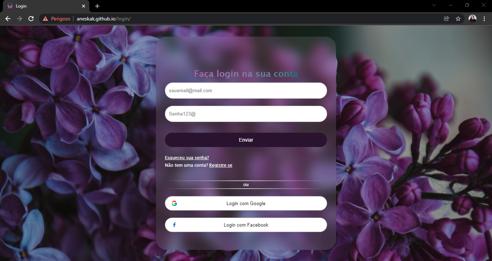
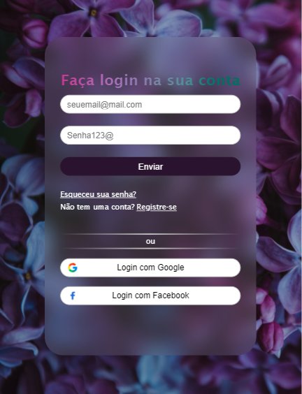

## 💻 Sobre o projeto

Tela de login usando glassmorphism e uma imagem no background.

## 🖼 Screenshot da tela web



## 🖼 Screenshot da tela mobile




## 🛠 Tecnologias

As seguintes ferramentas foram usadas na construção do projeto:

### **Front-end**

<br>
<p align="left">
  <a href="https://developer.mozilla.org/pt-BR/docs/Web/HTML" target="_blank">
    
  </a>

  <a href="https://developer.mozilla.org/pt-BR/docs/Web/CSS" target="_blank">
    
  </a>

<br>

## 👷 Como rodar

### **Clique <a href="https://aneskak.github.io/login/">aqui</a>, ou**
```bash
  
# Para clonar o repositório
git clone https://github.com/aneskak/login.git

# Entrar numa IDE de sua preferência 

# Executar o servidor ou usar um puglin que criar um servidor

```

## :mortar_board: Autores

<table align="center">
    <tr>
        <td align="center">
            <a href="https://github.com/aneskak">
                
                <br />
                <sub><b>Aneska Karina</b></sub>
            </a>
        </td>
    </tr>
</table>
<h4 align="center">
   Feito com 💖 por <a href="https://www.linkedin.com/in/aneska-karina-7521795b/" target="_blank"> Aneska Karina </a>
</h4>
